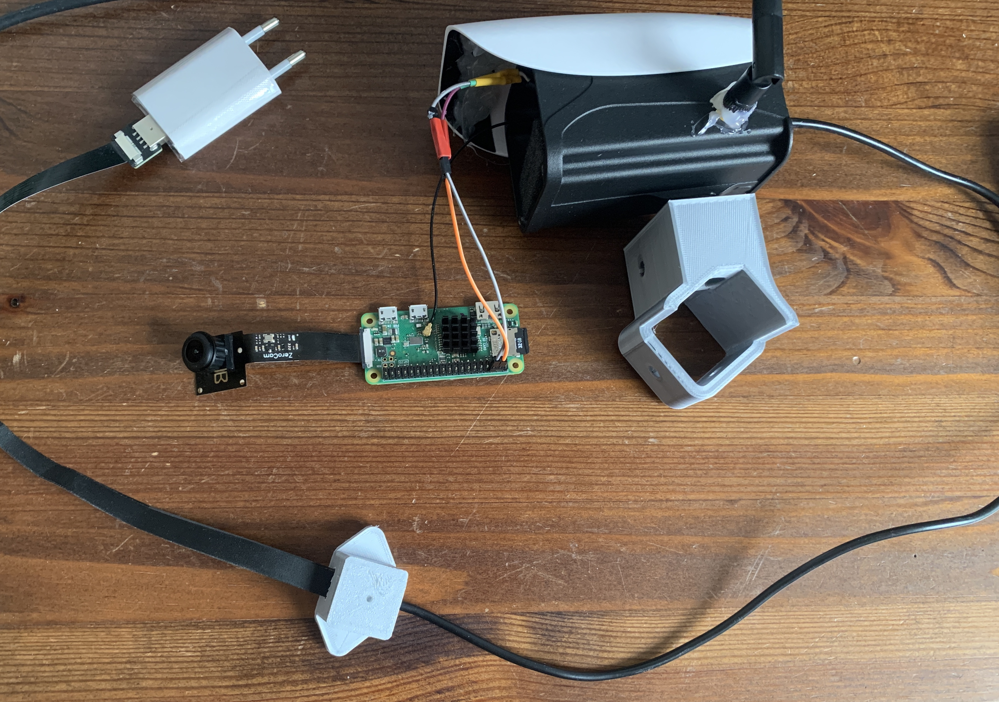

# RaspberryPi-Timelapse
The project is a tutorial on how to build and implement a long time lapse recording based on a Raspberry Pi. There is no camera that is affordable that has such features. You can easily create time-lapse recordings of your construction site, nature or other projects over a period of more than one year.

## Features:

- **Settable interval**: Set a periodic time interval, such as every day at 12:00 or every hour when the minutes show 30.
- **Stable service:** You do not have to start the script yourself, even after a reboot. The script is maintained by two services that manage all the processes.
- **Day/Night Mode**: The script automatically selects the best tested settings for day and night photos. It uses a library that looks for the sunrise and sunset times at your location and uses them as criteria for the settings.
- **Camera Settings**: You can set your own parameters so that the script suits your needs.
- **Weather/Outdoor Ready:** The setup is designed for outdoor use.
- **Power through the window:** The FFC cable easily fits through the gap of a window and provides a stable power connection without damaging the window or requiring a special outdoor power source.




## Components

- Raspberry Pi Zero WH V1
- 5MP RPIZ OV5647 Camera Module
- Weatherproof IP66 CCTV Camera Housing
- FFC/FPC/FPV Cable and Connectors
- UFL SMD Solder Connector
- UFL Antenna
- 3D printed Parts


## Software

Raspberry Pi OS Lite V5.15

## Steps 

1. Connect all wires and put the camera in the outdoor housing
2. Install the OS
3. Connect the Raspi to a monitor and enable SSH with the command: 
```
pi@IP:~$ sudo raspi-config
```
4. Connect with your device via SSH to the Raspi
5. Clone the repo and move the Python-Script in the home directory
6. Edit the parameters of timelapse.py
7. Create the images-folder:
```
pi@IP:~$ mkdir images
```
9. Move the service-files in the following directory, or create them, and copy the content:
```
pi@IP:~$ cd /lib/systemd/system

pi@IP:~$ sudo nano timelapse.service
pi@IP:~$ sudo nano timelapse.timer
```
8. Enable and start the services
```
pi@IP:~$ systemctl start timelapse.service
pi@IP:~$ systemctl enable timelapse.service

pi@IP:~$ systemctl start timelapse.timer
pi@IP:~$ systemctl enable timelapse.timer
```
9. You can copy the files to your remote machine:
```
remote:~$ rsync -r -t pi@IP:/home/pi/images/  /Users/remote/Desktop/images
```
